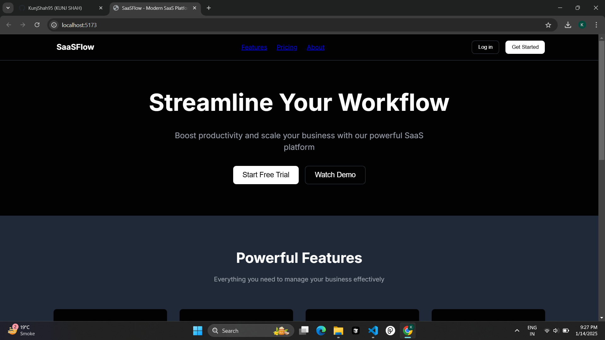

# SaaS Page Project ⚡

## Key Features ✨

- Fast, responsive design
- Intuitive user journey
- Modular components for quick setup
- Flexible layout for custom branding

## Possible Enhancements 🔮

- Add user authentication
- Payment gateway integration
- Analytics dashboard
- Localization support

## Usage 💡

1. Clone or download the repository
2. Install dependencies (`npm install`)
3. Run locally (`npm start`)

## Contributing 🤝

1. Fork this repo
2. Create a new branch (`git checkout -b feature-branch`)
3. Commit changes, then open a pull request

## License ⚖

This project is licensed under the [MIT License](LICENSE).
